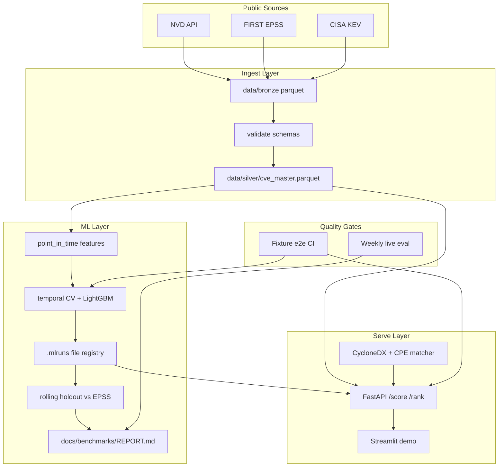

# PatchPilot Master Roadmap

**Authority:** This is the living execution handoff for PatchPilot.
**Contract companion:** [`PLAN.md`](PLAN.md) remains the schema / API / CLI contract.
**Audience:** Any coding agent (Cursor, Composer, GPT, Claude, etc.) or human engineer.
**Last updated:** 2026-07-18

---

## 0. How To Use This File

### Rules for every agent

1. Read this file before making changes.
2. Work **one phase slice at a time**. Do not mix unrelated phases in one PR.
3. Prefer acceptance tests before implementation when possible.
4. After completing work, update:
   - [Status Ledger](#8-status-ledger)
   - [Decision Log](#9-decision-log)
   - this `Last updated` date
5. Do **not** claim PatchPilot beats EPSS unless [`docs/benchmarks/REPORT.md`](docs/benchmarks/REPORT.md) proves it.
6. Do **not** build dashboards, LLM features, SHAP, conformal intervals, scanner integrations, or cloud deployment before Phase 2–4 gates are green.
7. Keep README benchmark numbers synchronized with `docs/benchmarks/REPORT.md`. Never leave stale “wins.”
8. If a task is blocked, write the blocker in the Decision Log and stop that slice cleanly.

### Suggested agent workflow

```
Ask/design  → approve acceptance criteria
Agent/code  → implement one slice only
Verify      → run Verification Matrix commands for that phase
Update      → Status Ledger + Decision Log
Commit      → only if acceptance passes
```

### Related documents

| Document | Role |
|----------|------|
| [`PLAN.md`](PLAN.md) | Schema, API, CLI contracts |
| [`README.md`](README.md) | User-facing overview + benchmark table |
| [`docs/architecture.md`](docs/architecture.md) | Layer diagram |
| [`docs/modeling.md`](docs/modeling.md) | Task, baseline, anti-leakage |
| [`docs/evaluation.md`](docs/evaluation.md) | Metrics + holdout protocol |
| [`docs/runbook.md`](docs/runbook.md) | Ops runbook |
| [`docs/benchmarks/REPORT.md`](docs/benchmarks/REPORT.md) | Current numeric benchmark |

---

## 1. North Star — Final Production Picture

PatchPilot becomes an **evidence-driven vulnerability prioritization platform**:

1. **Reproducible vulnerability data pipeline**
   - NVD + EPSS + KEV (and later optional GHSA / ExploitDB)
   - Bronze → validated Silver → point-in-time Features
   - Cacheable ingest, schema checks, freshness metadata

2. **Honest exploit-likelihood model**
   - Predicts 30-day exploitation likelihood (`exploited_30d`)
   - Temporal CV + right-censoring + point-in-time features
   - Head-to-head vs EPSS with ablations and uncertainty notes
   - Clear statement of where PatchPilot adds (or does not add) value

3. **Version-aware SBOM prioritization**
   - CycloneDX SBOM → component → CVE candidates
   - Inline VEX first; CPE/purl/version matching with match reasons
   - Ranked by model probability with CVSS / KEV context

4. **Reliable serving surface**
   - FastAPI: `/healthz`, `/model/info`, `/score`, `/rank`
   - Predictable degraded mode when model/silver missing
   - CLI + Streamlit demo as thin clients

5. **CI/CD that proves the story**
   - PR CI: fixture-based ingest → train → eval → API tests (no live NVD)
   - Weekly job: live ingest + real benchmark (optional secret `NVD_API_KEY`)

6. **Deployable operations**
   - Config via env + `settings.toml`
   - Docker images for API / trainer / demo
   - Scheduled ingest/retrain/eval separated from serving
   - Artifact versioning + `latest.json` rollback
   - Runbook for failure modes

7. **Optional product layer (only after credibility)**
   - GitHub Action for SBOM ranking in PRs
   - Scanner adapters (Trivy / Grype SBOM export)
   - Hosted API / light UI only if the core is trustworthy

### What success looks like

- A fresh clone can prove the pipeline on fixtures without network.
- Benchmarks are reproducible and never overstate results.
- SBOM ranking explains *why* a CVE matched a component.
- Recruiters / engineers can audit label definition, leakage controls, and holdout protocol.
- Deployment is boring and documented — not a one-off laptop demo.

---

## 2. Current Status (as of 2026-07-18)

### Verdict

PatchPilot is a **real, runnable prototype** with substantial scaffolding and recent integrity fixes (point-in-time features + rolling holdout). It is **not yet production-grade**. The model currently **underperforms EPSS** on the headline metrics. SBOM matching is still demo-grade. PR CI now runs fixture-based e2e (`make test-e2e`) with no live NVD/EPSS dependency — see [Status Ledger §8](#8-status-ledger) Phase 2.

### Area status

| Area | State | Notes |
|------|-------|-------|
| Ingest NVD/EPSS/KEV | **Real** | Live HTTP + optional cache; bronze parquet |
| Silver + label | **Real** | `exploited_30d` from KEV within 30d; schema validation |
| Point-in-time features | **Implemented** | `features/point_in_time.py` + `tests/test_feature_leakage.py` |
| Rolling holdout eval | **Implemented** | `train/holdout.py` + `eval/compare_epss.py` + tests |
| Train LightGBM | **Real** | Temporal CV, isotonic calibration, `.mlruns/` file registry |
| Benchmark vs EPSS | **Real but losing** | REPORT shows PP AUC-PR ~0.012 vs EPSS ~0.317 |
| FastAPI serve | **Real, under-tested** | No `TestClient` suite historically; being hardened |
| SBOM `/rank` | **Prototype** | Product-name index; version-aware matching in progress |
| Streamlit demo | **Thin** | HTTP client to API |
| CI | **Real** | Lint/type/unit-test/docker + fixture e2e job (`make test-e2e`) on every PR, no `NVD_API_KEY` needed |
| Weekly live eval | **Exists** | `.github/workflows/eval-vs-epss.yml` |
| MLflow client | **Stub** | Real registry is JSON under `.mlruns/` |
| Deployment | **Local Docker only** | Not production hardened |

### Current benchmark snapshot

From [`docs/benchmarks/REPORT.md`](docs/benchmarks/REPORT.md) (must stay in sync with README):

| Model | AUC-PR | AUC-ROC | P@100 | Brier | ECE |
|-------|--------|---------|-------|-------|-----|
| PatchPilot | 0.0118 | 0.6367 | 0.0500 | 0.0024 | 0.0007 |
| EPSS | 0.3174 | 0.9014 | 0.1000 | 0.0130 | 0.0232 |

**Interpretation:** Do not market PatchPilot as “better than EPSS.” Treat the model as a research challenger that currently loses; prioritize ablations and honest reporting.

### Key files

```
src/patchpilot/ingest/{nvd,epss,kev,silver}.py
src/patchpilot/features/{tabular,temporal,graph,point_in_time}.py
src/patchpilot/train/{train,holdout,temporal_cv,calibration}.py
src/patchpilot/eval/{metrics,compare_epss}.py
src/patchpilot/serve/{api,sbom,schemas}.py
src/patchpilot/models/{lgbm,baseline_epss}.py
src/patchpilot/flows/daily_ingest.py
tests/test_{label_construction,feature_leakage,eval_holdout,temporal_cv,sbom_parser,eval_metrics}.py
config/settings.toml
.github/workflows/{ci,eval-vs-epss}.yml
```

---

## 3. Architecture Map



---

## 4. Definition Of Production Ready

PatchPilot may be called **production-ready** only when all of the following are true:

1. Fixture e2e CI green without live network ingest.
2. API integration tests cover healthy + degraded modes.
3. SBOM matching returns `match_method` / `match_confidence` / `match_reason`.
4. Benchmark report includes window sizes, positive rate, and honest PP vs EPSS comparison.
5. Ablation report exists (EPSS-only / no-EPSS / full).
6. Docs never claim unimplemented backends (no fake MLflow).
7. Runbook covers first-run, retrain, eval, no-model mode, rollback.
8. Docker API + demo run against a known artifact.
9. Deployment docs exist and smoke checks pass.
10. Anti-LARP checklist below is fully checked.

---

## 5. Reverse-Engineered Roadmap

Work backward from the final picture to current state:

| Final capability | Depends on | Current gap |
|------------------|------------|-------------|
| Product integrations (GH Action, scanners) | Trustworthy ranks + API | SBOM + model credibility incomplete |
| Cloud deployment | Ops hardening + CI | Local Docker only |
| Ops hardening | API tests + fixtures | Partial |
| Model credibility | Ablations + honest eval | Losing to EPSS; ablations pending |
| SBOM version matching | Deeper CPE ingest + API schema | Product-name only |
| API correctness | Injectable state + tests | Under-tested |
| Fixture e2e CI | Frozen fixtures + makefile/CI | Done — see Status Ledger §8 Phase 2 |
| Contract/doc alignment | Roadmap + PLAN sync | Partially stale claims |
| Integrity foundation | PIT features + rolling holdout | **Largely done** |
| Ingest + silver + train + serve scaffold | — | **Done** |

---

## 6. Implementation Phases (Forward Plan)

### Phase 0 — Freeze The Truth
**Status:** DONE (this file)

**Goal:** One authoritative handoff document.

**Acceptance:**
- [x] `PATCHPILOT_MASTER_ROADMAP.md` exists
- [x] Status ledger and decision log present
- [x] Agents can start without chat history

---

### Phase 1 — Consistency And Contract Cleanup
**Status:** IN PROGRESS / DONE in this implementation pass

**Goal:** Docs match code. No fake MLflow claims.

**Tasks:**
- Align `PLAN.md` holdout language with rolling windows
- Align README / modeling / evaluation docs
- Document local `.mlruns/` JSON registry as the supported registry
- Mark `registry/mlflow_client.py` as optional future wrapper or implement thin wrappers

**Acceptance:**
- Docs do not claim Postgres MLflow or unimplemented APIs as done
- `uv run pytest -q` passes

---

### Phase 2 — Deterministic Fixture-Based E2E CI
**Status:** TARGET NEXT / DONE in this implementation pass

**Goal:** Prove pipeline without live NVD/EPSS.

**Tasks:**
- Commit small fixtures under `tests/fixtures/`
- Add `make test-e2e`
- Extend CI to run fixture e2e
- Keep weekly live eval separate

**Acceptance:**
- PR CI needs no `NVD_API_KEY`
- `make test-e2e` deterministic and fast
- Empty reports fail `assert_benchmark_gate`

---

### Phase 3 — API And Serving Correctness
**Status:** DONE in this implementation pass

**Goal:** Testable FastAPI with injectable paths.

**Tasks:**
- Injectable `STATE.load(mlruns_dir=..., silver_path=...)`
- `tests/test_api.py` with TestClient
- Degraded mode, unknown CVEs, invalid SBOM, batch limits

**Acceptance:**
- API tests in CI
- Degraded mode documented in runbook

---

### Phase 4 — SBOM Matching Upgrade
**Status:** DONE in this implementation pass

**Goal:** Defensible component→CVE mapping.

**Tasks:**
- Inline VEX remains highest confidence
- Version-aware product matching where version present
- `match_method`, `match_confidence`, `match_reason` on RankItem
- Expanded SBOM tests

**Acceptance:**
- Rank responses explain matches
- False-positive risk documented

---

### Phase 5 — Model Credibility And Research Loop
**Status:** DONE in this implementation pass (ablation tooling)

**Goal:** Decide challenger vs residual vs SBOM-context strategy with evidence.

**Tasks:**
- Ablation runner: EPSS-only / no-EPSS / full
- Write ablation section into report or `docs/benchmarks/ABLATIONS.md`
- Keep bootstrap / CI notes where cheap

**Acceptance:**
- Ablation report exists and is regenerable
- README/REPORT remain honest about EPSS comparison

---

### Phase 6 — Operational Hardening
**Status:** DONE in this implementation pass

**Goal:** Reliable local/container ops.

**Tasks:**
- Env overrides for data/mlruns paths
- Expanded runbook
- Artifact rollback notes
- Logging / request sanity

**Acceptance:**
- Fresh clone instructions work
- Runbook covers common failures

---

### Phase 7 — Deployment Path
**Status:** DOCUMENTED (implementation deferred until Phase 2–6 verified in CI)

**Goal:** Deploy only after credibility gates.

**Tasks:**
- Document target options and smoke checks
- Separate trainer schedule from API serving
- Secret handling for `NVD_API_KEY`

**Acceptance:**
- Deployment recreatable from docs
- Bad artifact does not hard-crash serving

---

### Phase 8 — Integrations And Product Layer
**Status:** BACKLOG (do not start yet)

**Goal:** GitHub Action / scanner adapters / optional UI after core is credible.

**Do not build yet** until Status Ledger shows Phases 2–6 green on main.

---

## 7. What NOT To Build Yet

- Next.js / custom dashboards
- LLM CVE summarizers / DistilBERT embeddings
- SHAP / conformal / Evidently drift UIs
- Scanner marketplace integrations
- Multi-tenant SaaS auth/billing
- Postgres MLflow backend
- Fabricated benchmark CSVs committed as “real” results
- Claiming production-grade before Definition Of Production Ready is met

---

## 8. Status Ledger

Update checkboxes when work lands. Use: `TODO` / `DOING` / `DONE` / `BLOCKED`.

| Phase | Status | Owner | Notes |
|-------|--------|-------|-------|
| 0 Freeze truth | DONE | agent | This file |
| 1 Contract cleanup | DONE | agent | PLAN/README/docs aligned |
| 2 Fixture e2e CI | DONE | agent | fixtures + make test-e2e + CI job |
| 3 API tests | DONE | agent | test_api.py + injectable STATE |
| 4 SBOM matching | DONE | agent | match metadata + version equality |
| 5 Ablations | DONE | agent | ablation CLI/report |
| 6 Ops hardening | DONE | agent | env paths + runbook |
| 7 Deployment | TODO | — | Docs only until CI green on main |
| 8 Integrations | TODO | — | Explicitly blocked |

### Checklist — production credibility

- [x] Master roadmap exists
- [x] Point-in-time features + leakage tests
- [x] Rolling holdout eval
- [x] Fixture e2e path
- [x] API TestClient suite
- [x] SBOM match metadata
- [x] Ablation report tooling
- [x] Ops runbook expanded
- [ ] Phase 7 deployed environment (optional)
- [ ] Phase 8 integrations (blocked)

---

## 9. Decision Log

| Date | Decision | Rationale | Follow-up |
|------|----------|-----------|-----------|
| 2026-07-18 | Root handoff file is `PATCHPILOT_MASTER_ROADMAP.md` | Durable across agents/tools; PLAN.md stays contract | Keep ledger updated |
| 2026-07-18 | Local JSON `.mlruns/` is the supported registry | MLflow client stub unused; avoid fake maturity | Optional thin wrappers later |
| 2026-07-18 | Rolling holdout replaces fixed 2025-01-01 cutoff | Fixed cutoff became empty under right-censoring | Keep `HELDOUT_PUBLISHED_FROM` deprecated |
| 2026-07-18 | Do not claim beat-EPSS | Current REPORT shows EPSS wins | Ablations + research loop |
| 2026-07-18 | Fixture CI before cloud/UI | Trust > polish | Phase 7/8 blocked |
| 2026-07-18 | SBOM responses include match metadata | Prevent silent overclaim of version precision | Expand CPE ranges later |

---

## 10. Risk Register

| Risk | Severity | Mitigation |
|------|----------|------------|
| Temporal leakage | High | PIT joins + leakage tests |
| Stale README metrics | High | Eval syncs README; unavailable → n/a |
| EPSS as feature while losing to EPSS | Medium | Ablations; honest narrative |
| SBOM false positives | High | Match reasons + version equality + docs |
| Live NVD in PR CI | High | Fixture e2e only in PR |
| Dependency bloat (unused SHAP/Prefect/GE) | Medium | Prefer used paths; avoid new unused deps |
| Overhyped portfolio claims | High | Anti-LARP checklist |
| Train fallback into holdout when sparse | Medium | Document; prefer more history |

---

## 11. Verification Matrix

| Phase | Commands / checks |
|-------|-------------------|
| 0 | File exists; sections present |
| 1 | Docs review; `uv run pytest -q` |
| 2 | `make test-e2e`; CI job without network ingest |
| 3 | `uv run pytest -q tests/test_api.py` |
| 4 | `uv run pytest -q tests/test_sbom_parser.py` |
| 5 | `uv run patchpilot eval --ablate` or `make ablate`; inspect ABLATIONS.md |
| 6 | Follow runbook first-run + no-model mode |
| 7 | Deploy smoke: `/healthz` `/model/info` `/score` `/rank` |
| Always | README table matches REPORT or shows n/a |

### Manual honesty checks

1. Trace 3 CVE feature rows to source timestamps.
2. Confirm holdout positives and row counts in REPORT.
3. Run `/rank` on `sample_sbom.json` and inspect match metadata.
4. Confirm degraded API when `.mlruns/latest.json` removed.

---

## 12. Agent Prompt Bank

### Prompt A — Fixture e2e (if regenerating)

```
Implement fixture-based e2e under tests/fixtures/ and make test-e2e.
PR CI must not call live NVD. Keep weekly eval-vs-epss separate.
Acceptance: make test-e2e and uv run pytest -q pass.
Update PATCHPILOT_MASTER_ROADMAP.md Status Ledger.
```

### Prompt B — API hardening

```
Make FastAPI STATE injectable for tests. Add tests/test_api.py covering
/healthz /model/info /score /rank, degraded mode, invalid SBOM.
Acceptance: pytest tests/test_api.py passes. Update ledger.
```

### Prompt C — SBOM matching

```
Upgrade serve/sbom.py to version-aware matching and add match_method,
match_confidence, match_reason to RankItem. Expand tests.
Do not add scanner integrations. Update ledger + decision log.
```

### Prompt D — Ablations

```
Add EPSS-only / no-EPSS / full-model ablation report writer.
Do not add DistilBERT/SHAP. Update docs/benchmarks/ABLATIONS.md and ledger.
```

### Prompt E — Ops

```
Add env path overrides, expand docs/runbook.md with rollback and no-model
recovery. No cloud deploy yet. Update ledger.
```

---

## 13. Anti-LARP Checklist

Before any portfolio post, demo, or “production” claim:

- [ ] `docs/benchmarks/REPORT.md` has real numbers or honest unavailable status
- [ ] README table matches REPORT exactly
- [ ] You can explain one CVE score via 3 features + timestamps
- [ ] Holdout positives and n rows documented
- [ ] Ablation exists showing EPSS-only vs full model
- [ ] API tests exist and pass
- [x] Fixture e2e CI exists and does not need live NVD
- [ ] SBOM `/rank` shows match metadata
- [ ] No `NotImplementedError` on claimed-done paths used by CLI/API
- [ ] You state honestly whether PatchPilot beats EPSS

---

## 14. Immediate Next Work After This Pass

1. Verify CI green on main with fixture e2e.
2. Run live ingest+train+eval when ready; refresh REPORT honestly.
3. Use ablation results to choose model strategy (challenger vs residual vs SBOM-context).
4. Only then start Phase 7 deployment or Phase 8 integrations.

---

## 15. Local Registry Contract (supported)

Training persists:

```
.mlruns/<run_id>/model.pkl
.mlruns/<run_id>/metadata.json
.mlruns/latest.json   # {run_id, artifact, model_version}
```

Serving loads `latest.json` then the artifact. This is the supported registry.
`src/patchpilot/registry/mlflow_client.py` may expose thin helpers; a full
MLflow tracking server is **not** required for production readiness.
