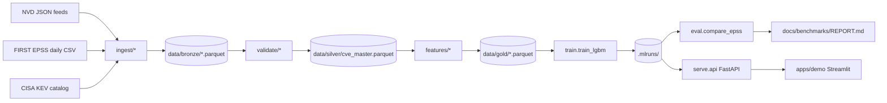

# PatchPilot

PatchPilot is an open-source ML system that predicts which CVEs will be
exploited within the next 30 days and ranks the vulnerabilities discovered
in a CycloneDX SBOM by that probability. It is benchmarked head-to-head
against the public EPSS baseline on the same rolling closed-window holdout
(most recent right-censored slice meeting configured minimums) with the same
metrics, so users can see whether (and where) PatchPilot beats the freely
available reference.

## Architecture



## Benchmark — PatchPilot vs EPSS

<!-- Auto-updated by .github/workflows/eval-vs-epss.yml on the weekly cron.
     See docs/benchmarks/REPORT.md for the full report. -->

| Model       | AUC-PR | AUC-ROC | P@100 | Brier | ECE |
| ----------- | ------ | ------- | ----- | ----- | --- |
| PatchPilot  | 0.012 | 0.637 | 0.050 | 0.002 | 0.001 |
| EPSS        | 0.317 | 0.901 | 0.100 | 0.013 | 0.023 |

Numbers are populated by `make eval` after ingest/train on your silver snapshot.
`n/a` values mean metrics are unavailable — see [`docs/benchmarks/REPORT.md`](docs/benchmarks/REPORT.md) for the reason.
Weekly cron: [`.github/workflows/eval-vs-epss.yml`](.github/workflows/eval-vs-epss.yml).

## Quickstart

```
make up        # build + start api (:8000) and demo (:8501)
make ingest    # Phase 1: bronze + silver (default NVD since from config/settings.toml)
make train     # Phase 2: LightGBM artifact + metadata under .mlruns/<run_id>/
make eval      # Phase 3: writes docs/benchmarks/REPORT.md (real numeric metrics)
make serve     # Phase 4: FastAPI service on :8000
make demo      # Streamlit on :8501 (talks to the API at PATCHPILOT_API)
```

The first `make ingest` issues live calls to NVD, EPSS, and CISA KEV. By default
the CLI pulls up to **`--nvd-max-records 50000`** CVEs starting from **`[ingest].nvd_since`**
in [`config/settings.toml`](config/settings.toml) (currently `2018-01-01`) unless you pass `--since`.

Set **`NVD_API_KEY`** in the environment so PatchPilot uses **~0.6s** sleeps between NVD pages;
without a key, pacing stays at **~6.5s** per page to respect the public rate limit.

Use **`--cache-dir`** to persist raw API payloads for reproducible offline re-ingest:

```
uv run patchpilot ingest --source nvd --cache-dir data/cache
uv run patchpilot ingest --source kev
uv run patchpilot ingest --source epss
```

Local development (no Docker):

```
pip install uv && uv python install 3.11
uv sync
uv run pytest -q
uv run patchpilot serve --port 8000
```

### Try the API

```
curl http://localhost:8000/healthz
curl http://localhost:8000/model/info
curl -X POST http://localhost:8000/score \
     -H 'content-type: application/json' \
     -d '{"cve_ids":["CVE-2022-42475","CVE-2023-21674"]}'
curl -X POST http://localhost:8000/rank \
     -H 'content-type: application/json' \
     -d @sample_sbom.json
```

## Repository layout

```
src/patchpilot/{ingest,validate,features,models,train,eval,serve,registry}
flows/daily_ingest.py
apps/demo/streamlit_app.py
config/settings.toml
docs/{architecture,data-sources,modeling,evaluation,runbook}.md
docs/benchmarks/REPORT.md
infra/docker/Dockerfile.{api,trainer,demo}
.github/workflows/{ci,eval-vs-epss}.yml
tests/{test_imports,test_label_construction,test_temporal_cv,test_sbom_parser,test_eval_metrics}.py
```

## Status

| Phase | What lands                                | State |
| ----- | ----------------------------------------- | ----- |
| 0     | Scaffold + CI + dockerfiles               | green |
| 1     | NVD / EPSS / KEV ingest -> silver + label | green |
| 2     | Features + temporal CV + LightGBM        | green |
| 3     | Metrics + EPSS comparison report          | green |
| 4     | FastAPI `/healthz` `/model/info` `/score` `/rank` + Streamlit demo | green |
| 5     | End-to-end + CI green on main             | pending |
| 6     | Conformal, SHAP, Evidently, etc.          | backlog |

Phase 1-4 are real, end-to-end runnable, and produce the artifacts under
`data/`, `.mlruns/`, and `docs/benchmarks/REPORT.md`. The benchmark table
above is auto-rewritten by `make eval`.

This sprint deliberately uses a **local file model registry** under
`.mlruns/<run_id>/` (model artifact + JSON metadata + `latest.json`
pointer) instead of an MLflow tracking backend; the read/write surface
is small enough to wrap in `mlflow.start_run` later without changing
call sites. See `src/patchpilot/train/train.py`.

## Roadmap

The full five-phase build plan, schema contract, API contract, and CLI
contract live in [`PLAN.md`](PLAN.md). The Phase 6 stretch list
(conformal prediction, SHAP, Evidently, ExploitDB, GHSA, DistilBERT,
daily retrain) is gated behind Phases 1-5 being green - see
[Phase 6 in PLAN.md](PLAN.md#2-stretch-list-phase-6--only-after-15-green).

## License

Apache-2.0.
