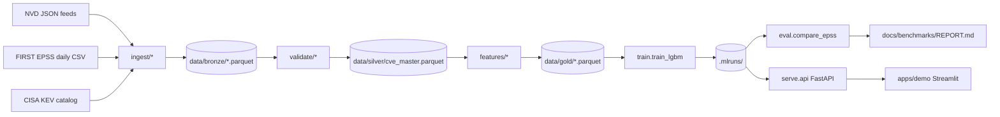

# PatchPilot

PatchPilot is an open-source ML system that predicts which CVEs will be
exploited within the next 30 days and ranks the vulnerabilities discovered
in a CycloneDX SBOM by that probability. It is benchmarked head-to-head
against the public EPSS baseline on the same rolling closed-window holdout
(most recent right-censored slice meeting configured minimums) with the same
metrics, so users can see whether (and where) PatchPilot beats the freely
available reference.

## Architecture



## Benchmark — PatchPilot vs EPSS

<!-- Auto-updated by .github/workflows/eval-vs-epss.yml on the weekly cron.
     See docs/benchmarks/REPORT.md for the full report. -->

| Model       | AUC-PR | AUC-ROC | P@100 | Brier | ECE |
| ----------- | ------ | ------- | ----- | ----- | --- |
| PatchPilot  | 0.019 | 0.835 | 0.040 | 0.003 | 0.002 |
| EPSS        | 0.250 | 0.983 | 0.140 | 0.004 | 0.007 |

Numbers are populated by `make eval` after ingest/train on your silver snapshot.
`n/a` values mean metrics are unavailable — see [`docs/benchmarks/REPORT.md`](docs/benchmarks/REPORT.md) for the reason.
Weekly cron: [`.github/workflows/eval-vs-epss.yml`](.github/workflows/eval-vs-epss.yml).

## Quickstart

```
make up        # build + start api (:8000) and demo (:8501)
make ingest    # bronze + silver (default NVD since from config/settings.toml)
make train     # LightGBM artifact + metadata under .mlruns/<run_id>/
make eval      # writes docs/benchmarks/REPORT.md (real numeric metrics or honest n/a)
make test-e2e  # fixture-based ingest/train/eval/API smoke (no live NVD)
make serve     # FastAPI service on :8000
make demo      # Streamlit on :8501 (talks to the API at PATCHPILOT_API)
```

The first `make ingest` issues live calls to NVD, EPSS, and CISA KEV. By default
the CLI pulls up to **`--nvd-max-records 50000`** CVEs starting from **`[ingest].nvd_since`**
in [`config/settings.toml`](config/settings.toml) (currently `2018-01-01`) unless you pass `--since`.

Set **`NVD_API_KEY`** in the environment so PatchPilot uses **~0.6s** sleeps between NVD pages;
without a key, pacing stays at **~6.5s** per page to respect the public rate limit.

Use **`--cache-dir`** to persist raw API payloads for reproducible offline re-ingest:

```
uv run patchpilot ingest --source nvd --cache-dir data/cache
uv run patchpilot ingest --source kev
uv run patchpilot ingest --source epss
```

Local development (no Docker):

```
pip install uv && uv python install 3.11
uv sync
uv run pytest -q
uv run patchpilot serve --port 8000
```

### Try the API

```
curl http://localhost:8000/healthz
curl http://localhost:8000/model/info
curl -X POST http://localhost:8000/score \
     -H 'content-type: application/json' \
     -d '{"cve_ids":["CVE-2022-42475","CVE-2023-21674"]}'
curl -X POST http://localhost:8000/rank \
     -H 'content-type: application/json' \
     -d "{\"sbom\": $(cat sample_sbom.json)}"
```

On Windows PowerShell, wrap the SBOM yourself:

```
@{ sbom = (Get-Content sample_sbom.json | ConvertFrom-Json) } | ConvertTo-Json -Depth 20
```


## Repository layout

```
src/patchpilot/{ingest,validate,features,models,train,eval,serve,registry}
flows/daily_ingest.py
apps/demo/streamlit_app.py
config/settings.toml
docs/{architecture,data-sources,modeling,evaluation,runbook}.md
docs/benchmarks/REPORT.md
infra/docker/Dockerfile.{api,trainer,demo}
.github/workflows/{ci,eval-vs-epss}.yml
tests/test_*.py
tests/fixtures/
PATCHPILOT_MASTER_ROADMAP.md
```

## Status

| Phase | What lands                                | State |
| ----- | ----------------------------------------- | ----- |
| 0     | Scaffold + CI + dockerfiles               | green |
| 1     | NVD / EPSS / KEV ingest -> silver + label | green |
| 2     | Point-in-time features + temporal CV + LightGBM | green |
| 3     | Rolling holdout metrics + EPSS comparison | green |
| 4     | FastAPI `/healthz` `/model/info` `/score` `/rank` + Streamlit demo | green |
| 5     | Fixture e2e + CI green on main            | green |
| 6+    | Ablations, ops hardening, deploy, integrations | see master roadmap |

Phases 1–5 are real and runnable. The benchmark table above is
auto-rewritten by `make eval`. **Current numbers show EPSS ahead** —
do not claim PatchPilot superiority without a fresh REPORT that proves it.

Model artifacts use a **local file registry** under `.mlruns/<run_id>/`
(model pickle + JSON metadata + `latest.json` pointer). A hosted MLflow
tracking server is optional and not required.

## Roadmap

- **Living execution plan / agent handoff:** [`PATCHPILOT_MASTER_ROADMAP.md`](PATCHPILOT_MASTER_ROADMAP.md)
- **Schema / API / CLI contract:** [`PLAN.md`](PLAN.md)

Stretch items (SHAP, conformal, GHSA, DistilBERT, scanner integrations,
cloud deploy) are gated behind the master roadmap credibility checklist.

## License

Apache-2.0.
