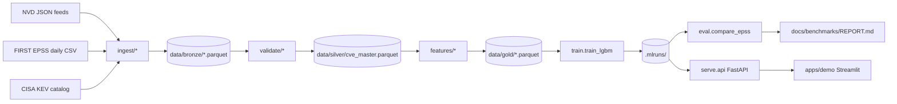

# PatchPilot

[](https://github.com/ihassanrayan-max/patchpilot/actions/workflows/ci.yml)
[](LICENSE)

PatchPilot is an open-source SBOM vulnerability ranker that blends a
PatchPilot residual signal with EPSS (`probability = clamp01(epss +
residual)`), so scores never silently zero out a CVE that EPSS already
flags as risky. Rank a CycloneDX SBOM via the **API**, the **`patchpilot
rank` CLI**, or a **consumer GitHub Action** you can drop into another
repo's CI. Head-to-head numbers against the public EPSS baseline stay
honest: both are scored on the same rolling closed-window holdout with the
same point-in-time EPSS feature, and [`docs/benchmarks/REPORT.md`](docs/benchmarks/REPORT.md)
is the source of truth — this README never claims a win the report doesn't back up.

## Architecture



## Benchmark — PatchPilot vs EPSS

<!-- Auto-updated by .github/workflows/eval-vs-epss.yml on the weekly cron.
     See docs/benchmarks/REPORT.md for the full report. -->

| Model       | AUC-PR | AUC-ROC | P@100 | Brier | ECE |
| ----------- | ------ | ------- | ----- | ----- | --- |
| PatchPilot  | 1.000 | 1.000 | 0.056 | 0.004 | 0.032 |
| EPSS        | 1.000 | 1.000 | 0.056 | 0.011 | 0.098 |

Numbers are populated by `make eval` after ingest/train on your silver snapshot.
`n/a` values mean metrics are unavailable — see [`docs/benchmarks/REPORT.md`](docs/benchmarks/REPORT.md) for the reason.
Weekly cron: [`.github/workflows/eval-vs-epss.yml`](.github/workflows/eval-vs-epss.yml).

On the current holdout (small local snapshot — see REPORT for row/positive
counts) PatchPilot's EPSS-complement blend **ties EPSS on AUC-PR/AUC-ROC and
improves calibration** (lower Brier/ECE); it does **not** beat EPSS on
ranking quality yet. [`docs/benchmarks/ABLATIONS.md`](docs/benchmarks/ABLATIONS.md)
breaks this down further (EPSS-only / full classifier / no-EPSS / complement).
Do not repeat a "PatchPilot beats EPSS" claim anywhere without pointing at a
fresh REPORT that shows it.

## Quickstart

```
uv sync        # or: pip install uv && uv python install 3.11 && uv sync
make test-e2e  # fixture-based ingest/train/eval/API/rank smoke (no live NVD)
uv run patchpilot rank --sbom sample_sbom.json --local   # ranked JSON to stdout
```

That's the fastest path to a working developer loop: no live network calls,
no API server, just fixtures → trained artifact → ranked SBOM. The table
below covers the full workflow, including live ingest and the API/Action paths.

```
make up        # build + start api (:8000) and demo (:8501)
make ingest    # bronze + silver (default NVD since from config/settings.toml)
make train     # LightGBM artifact + metadata under .mlruns/<run_id>/
make eval      # writes docs/benchmarks/REPORT.md (real numeric metrics or honest n/a)
make ablate    # writes docs/benchmarks/ABLATIONS.md (EPSS-only/full/no-EPSS/complement)
make test-e2e  # fixture-based ingest/train/eval/API smoke (no live NVD)
make serve     # FastAPI service on :8000
make demo      # Streamlit on :8501 (talks to the API at PATCHPILOT_API)
```

The first `make ingest` issues live calls to NVD, EPSS, and CISA KEV. By default
the CLI pulls up to **`--nvd-max-records 50000`** CVEs starting from **`[ingest].nvd_since`**
in [`config/settings.toml`](config/settings.toml) (currently `2018-01-01`) unless you pass `--since`.

Set **`NVD_API_KEY`** in the environment so PatchPilot uses **~0.6s** sleeps between NVD pages;
without a key, pacing stays at **~6.5s** per page to respect the public rate limit.

Use **`--cache-dir`** to persist raw API payloads for reproducible offline re-ingest:

```
uv run patchpilot ingest --source nvd --cache-dir data/cache
uv run patchpilot ingest --source kev
uv run patchpilot ingest --source epss
```

Local development (no Docker):

```
pip install uv && uv python install 3.11
uv sync
uv run pytest -q
uv run patchpilot serve --port 8000
```

### Rank a SBOM with the CLI

`patchpilot rank` works two ways: **`--local`** scores in-process (loads the
model/silver directly — no server needed, EPSS-only fallback if nothing is
trained yet) or **`--api`** posts to a running PatchPilot API. Ranked JSON is
written to stdout either way:

```
uv run patchpilot rank --sbom sample_sbom.json --local
uv run patchpilot rank --sbom sample_sbom.json --api http://localhost:8000
```

### Try the API directly

```
curl http://localhost:8000/healthz
curl http://localhost:8000/readyz
curl http://localhost:8000/model/info
curl -X POST http://localhost:8000/score \
     -H 'content-type: application/json' \
     -d '{"cve_ids":["CVE-2022-42475","CVE-2023-21674"]}'
curl -X POST http://localhost:8000/rank \
     -H 'content-type: application/json' \
     -d "{\"sbom\": $(cat sample_sbom.json)}"
```

On Windows PowerShell, wrap the SBOM yourself:

```
@{ sbom = (Get-Content sample_sbom.json | ConvertFrom-Json) } | ConvertTo-Json -Depth 20
```

### Rank a SBOM in someone else's CI (consumer GitHub Action)

PatchPilot ships a composite Action ([`.github/actions/rank-sbom`](.github/actions/rank-sbom))
that another repo's workflow can call directly — it fails the job if `/readyz`
isn't ready, then posts the SBOM to `/rank`:

```yaml
- uses: your-org/PatchPilot/.github/actions/rank-sbom@v0.1.0
  with:
    sbom-path: path/to/sbom.json
    api-url: https://your-patchpilot-instance.example.com
    output-path: ranked.json
```

See [`.github/workflows/example-rank-sbom.yml`](.github/workflows/example-rank-sbom.yml)
for a runnable `workflow_dispatch` sample, and
[`docs/runbook.md`](docs/runbook.md#use-in-your-ci) for the full "use in your CI" guide
(inputs/outputs, prerequisites, release-wheel install).


## Repository layout

```
src/patchpilot/{ingest,validate,features,models,train,eval,serve,registry}
flows/daily_ingest.py
apps/demo/streamlit_app.py
config/settings.toml
docs/{architecture,data-sources,modeling,evaluation,runbook}.md
docs/benchmarks/{REPORT,ABLATIONS}.md
infra/docker/Dockerfile.{api,trainer,demo}
.github/workflows/{ci,eval-vs-epss,release,example-rank-sbom}.yml
.github/actions/rank-sbom/action.yml
tests/test_*.py
tests/fixtures/
LICENSE · CONTRIBUTING.md
PLAN.md · PATCHPILOT_MASTER_ROADMAP.md
```

## Status

| Area | What lands | State |
| ---- | ---------- | ----- |
| Ingest + silver + label | NVD / EPSS / KEV -> silver + `exploited_30d` | green |
| ML | Point-in-time features + temporal CV + LightGBM EPSS-complement | green |
| Eval | Rolling holdout vs EPSS + ablations (`docs/benchmarks/`) | green |
| Serve | FastAPI `/healthz` `/readyz` `/model/info` `/score` `/rank` | green |
| CLI | `patchpilot ingest/train/eval/rank/serve` | green |
| Fixture e2e + CI | `make test-e2e`, no live NVD needed on PRs | green |
| Packaging | Apache-2.0 LICENSE, `uv build` sdist/wheel, `release.yml` on tag | green |
| Consumer Action | `.github/actions/rank-sbom` (fails if API not `/readyz`) | shipped |
| Cloud deploy | Documented (Docker Compose + runbook); no hosted instance | optional / docs-only |

The benchmark table above is auto-rewritten by `make eval`. **PatchPilot
currently ties EPSS on discrimination and does not beat it** — see the
benchmark section above and [`docs/benchmarks/REPORT.md`](docs/benchmarks/REPORT.md)
for exact numbers; do not claim superiority without a fresh REPORT that proves it.

Model artifacts use a **local file registry** under `.mlruns/<run_id>/`
(model pickle + JSON metadata + `latest.json` pointer). A hosted MLflow
tracking server is optional and not required.

## Roadmap

- **Living execution plan / agent handoff:** [`PATCHPILOT_MASTER_ROADMAP.md`](PATCHPILOT_MASTER_ROADMAP.md)
- **Schema / API / CLI contract:** [`PLAN.md`](PLAN.md)

The consumer Action and CLI/API rank surface have shipped. Cloud/hosted
deployment stays optional and documentation-only (see
[`docs/runbook.md`](docs/runbook.md#deployment-notes-phase-7)) until the
master roadmap credibility checklist is green. Stretch items (SHAP,
conformal, GHSA, DistilBERT, additional scanner integrations) remain gated
behind that same checklist.

## License

Apache-2.0.
