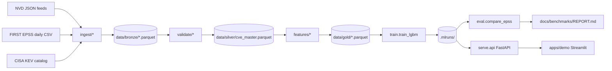

# PatchPilot

PatchPilot is an open-source ML system that predicts which CVEs will be
exploited within the next 30 days and ranks the vulnerabilities discovered
in a CycloneDX SBOM by that probability. It is benchmarked head-to-head
against the public EPSS baseline on the same held-out window with the same
metrics, so users can see whether (and where) PatchPilot beats the freely
available reference.

## Architecture



## Benchmark — PatchPilot vs EPSS

<!-- Auto-updated by .github/workflows/eval-vs-epss.yml on the weekly cron.
     See docs/benchmarks/REPORT.md for the full report. -->

| Model       | AUC-PR | AUC-ROC | P@100 | Brier | ECE |
| ----------- | ------ | ------- | ----- | ----- | --- |
| PatchPilot  |   —    |    —    |   —   |   —   |  —  |
| EPSS        |   —    |    —    |   —   |   —   |  —  |

Numbers are populated by Phase 3 (`make eval`) and refreshed weekly by
[`.github/workflows/eval-vs-epss.yml`](.github/workflows/eval-vs-epss.yml).

## Quickstart

```
make up        # build + start api (:8000) and demo (:8501)
make ingest    # Phase 1: bronze/silver lakes
make train     # Phase 2: LightGBM + MLflow run under .mlruns/
make eval      # Phase 3: writes docs/benchmarks/REPORT.md
```

Local development (no Docker):

```
pip install uv && uv python install 3.11
uv sync
uv run pytest -q
uv run patchpilot serve --port 8000
```

## Repository layout

```
src/patchpilot/{ingest,validate,features,models,train,eval,serve,registry}
flows/daily_ingest.py
apps/demo/streamlit_app.py
config/settings.toml
docs/{architecture,data-sources,modeling,evaluation,runbook}.md
docs/benchmarks/REPORT.md
infra/docker/Dockerfile.{api,trainer,demo}
.github/workflows/{ci,eval-vs-epss}.yml
tests/{test_imports,test_label_construction,test_temporal_cv,test_sbom_parser}.py
```

## Roadmap

The full five-phase build plan, schema contract, API contract, and CLI
contract live in [`PLAN.md`](PLAN.md). The Phase 6 stretch list
(conformal prediction, SHAP, Evidently, ExploitDB, GHSA, DistilBERT,
daily retrain) is gated behind Phases 1–5 being green — see
[Phase 6 in PLAN.md](PLAN.md#2-stretch-list-phase-6--only-after-15-green).

## License

Apache-2.0.
