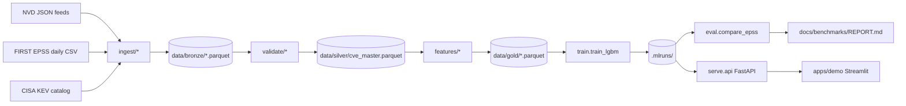

# Architecture

## Layers

- **Bronze** — raw, append-only Parquet from NVD/EPSS/KEV.
- **Silver** — `data/silver/cve_master.parquet` (the schema contract; see `PLAN.md`).
- **Gold** — feature matrices for training/eval.
- **Registry** — MLflow file backend at `.mlruns`.
- **Serve** — FastAPI app exposing `/score`, `/rank`, `/healthz`.
- **Demo** — Streamlit app that uploads an SBOM and calls `/rank`.

Details for each phase land in `PLAN.md`.
